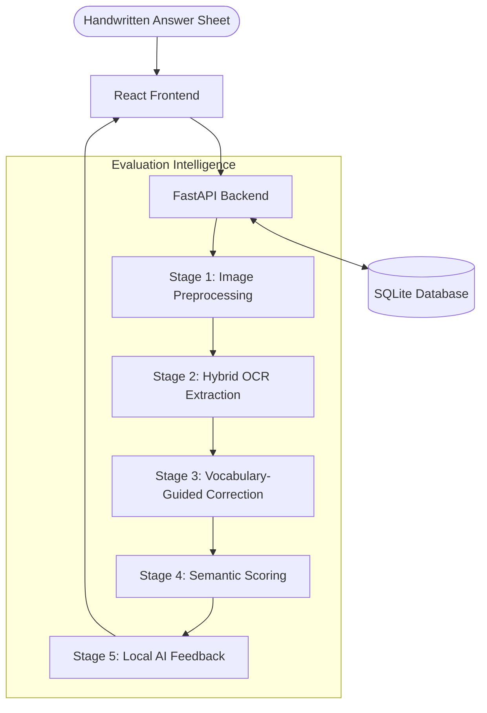

# 🎓 EduEvalve

**EduEvalve** is a free, open-source, and local-first AI exam evaluation system. It leverages cutting-edge AI models for OCR, semantic scoring, and automated feedback, all running entirely on your local hardware to ensure privacy and cost-efficiency.

---

## 🏗️ Project Architecture & System Design

EduEvalve follows a modular 5-stage evaluation pipeline to ensure high accuracy and explainability.

### 🔄 The 5-Stage Evaluation Pipeline



### 🛠️ Key Technology Stack

- **Hybrid OCR Engine**: Uses **TrOCR** (English handwriting) and **EasyOCR** (Indic languages & layout detection).
- **OCR Refinement**: Custom vocabulary-guided correction using **RapidFuzz** and **PySpellChecker** to match Gemini-level accuracy without APIs.
- **Semantic Scoring**: **SBERT** (Sentence-Transformers) for grading based on the meaning of the answer.
- **Local AI Agency**: **Ollama (Llama 3.2)** for generating human-like feedback and detailed explanations.
- **Frontend**: **React** with Vite for a responsive, modern interface.
- **Backend**: **FastAPI** with **SQLAlchemy** (SQLite).

---

## 📂 Project Structure

| Directory | Purpose |
| :--- | :--- |
| `backend/` | FastAPI server, AI model integration, and database services. |
| `frontend/` | React single-page application for the user interface. |
| `backend/services/` | Core business logic (OCR, scoring, feedback generation). |
| `backend/database/` | Database schema and SQLite persistence. |

---

## 🚀 Getting Started

Detailed instructions for setting up the backend and frontend are available in:
👉 **[setup_instructions.md](./setup_instructions.md)**

---

## 📊 Evaluation Tools

For developers, a terminal-based evaluation tool is included to test model accuracy:
```powershell
# From the backend directory
python matrix_evaluation.py
```

---

## ⚖️ License
Open source and free for educational use.
